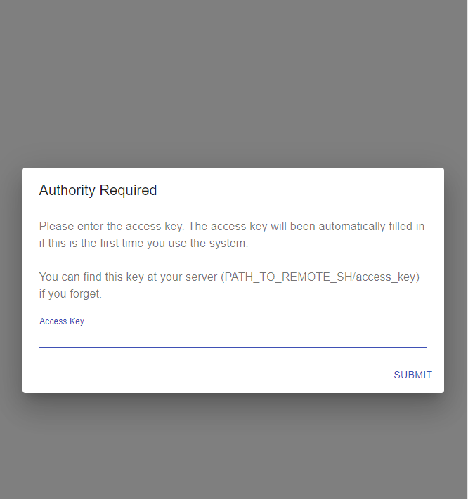
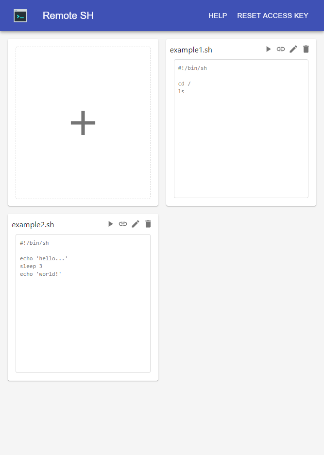
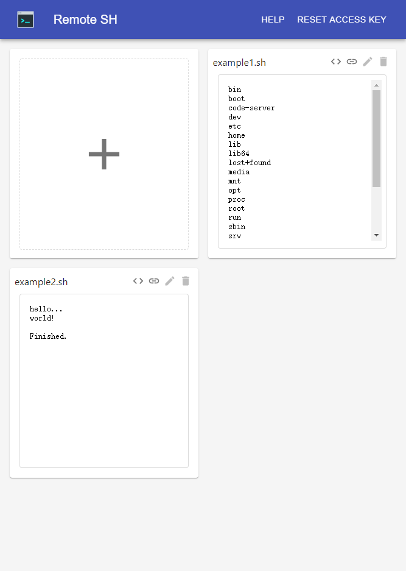

# remote-sh

Managing & runing your shell scripts on web!

`remote-sh` provides a friendly way for managing your shell scripts on your server. you can add, edit, remove, run your scripts easily.

Each script can be triggered by a UNIQUE URL so you can use it anywhere like:

```
$ curl https://YOUR_REMOTE_SH_HOST/script/run/example.sh/UNIQUE_SIGN_FOR_THIS_SCRIPT
```

The system use Access Key policy to identify yourself.





## Install

```
$ npm ci
```

## Deploy

All you need is keeping this running:

```
$ npm start
```

### Port

Set port at file `./configs.js` ( default: 3000 ).

### HTTPS

We strongly recommend that enabling the HTTPS feature.

To start your web server with HTTPS, you must set `useHttps: true` and `port: 443` at file `./configs.js`, then copy your certificate files to `./https/server.key` and `./https/server.crt`.

You can also use other ways for HTTPS ( for me, i'd like to try [steveltn/https-portal](https://hub.docker.com/r/steveltn/https-portal/) ).

### Background Running

`pm2, screen, docker` will help you doing that.
